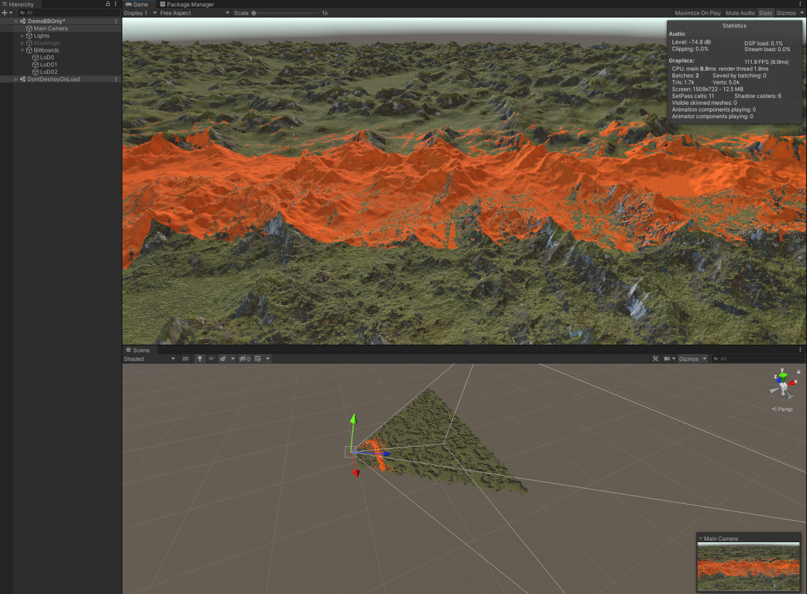

# Mountains Beyond Mountains (MBM)

(20km draw distance w/ 3 lods)

## Introduction:

This tool is intended to allow you to draw *vast* amounts of procedural terrain in Unity. Currently, this terrain is virtual. By virtual we mean only to be seen and not interacted with on the CPU side, so no colliders, no game objects etc. We plan to optionally include mesh collider generation in the near future. To drive this system we need:

 - A Height source
 - A method for tracking the current camera position

On the horizon are support for:
 - Biomes
 - Erosion / Cavity

The input system is modular and interface driven, which hopefully encourages plugin development of new height sources. Currently there are plugins for:
 - MapMagic2 | [Guide](./Generation/MapMagic2/README.md) | [Store Link (Free)](https://assetstore.unity.com/packages/tools/terrain/mapmagic-2-165180)

## Core Principles:
 - GPU Efficient
    - Indirect Instanced Draw
    - Compute Shader Based Frustrum Culling
 - CPU Efficient
    - GC avoidance (within reason) 
    - Multi-Threaded Height Request Dispatch
 - Modular and Extensible
    - Better Shaders based demo shader
    - [MicroSplat Procedural Support](./MicroSplatPlugin/README.md)
    - MapMagic2 Integration ( Heights and Position Leader ) 
    - Pluggable Height Generation System (Just fill a NativeSlice<float>)

## Quickstart:

MBM installs via the Unity Package Manager, which means the best way to include this library in your project is to [point UPM at this git repository](https://docs.unity3d.com/Manual/upm-ui-giturl.html). It'll be included in your project's `Packages`, *not* in Assets. Use the git url: `https://github.com/xshazwar/mountains-beyond-mountains.git`

You can pull a specific version by appending the tag you want to the git url.

While you're in UPM, in the MBM window under Samples, import the `MapMagic2` sample. The sample *will* end up in your Assets folder in `/Samples/Mountains Beyond Mountains`. These demo scenes available rely on the free version of MapMagic2 for height generation, so you'll want to grab that from the [asset store link](https://assetstore.unity.com/packages/tools/terrain/mapmagic-2-165180).

Open up the Demo Scene that corresponds with your render pipeline and poke around, that should be it!

#### Common Issues!

- If the material "BillBoard" shows up pink / terrain doesn't show in the demo scenes.

BetterShaders should pick up your platform and compile the correct render pipeline version of the shader for you. For some reason this doesn't always happen on install via UPM. If the material isn't working in the project explorer in Unity, navigate to /Packages. Right click on the `Mountains Beyond Mountains` folder. Select `Reimport`. That should correct the issue.

